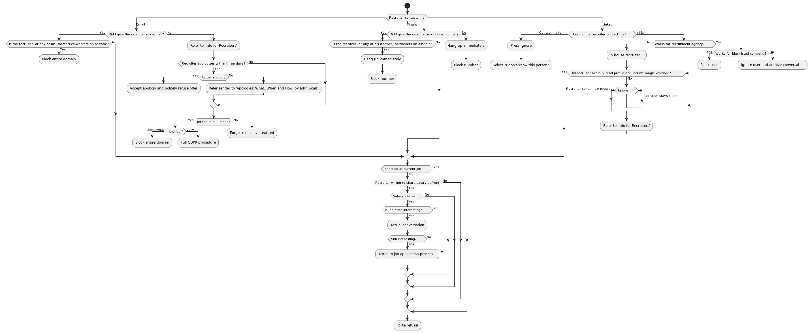

Hello there! If you're reading this then you're either a sentient web spider, or a human being looking for 
an **experienced software developer**. I might have even sent you here after you messaged
 [me on LinkedIn](https://www.linkedin.com/in/jeroen-steenbeeke-1b13676/). 
 
Before we continue, a few words of warning:

 * I am currently employed, and not interested in leaving
   * I'm not a freelancer
 * I work a 32 hour part-time job (Monday, Tuesday, Thursday and Friday), this is non-negotiable
 * I am not willing to relocate
 * **[NO AGENCY RECRUITERS](#no-agency-recruiters)**
   * No [foreign recruiters](#foreign-recruiters) either
 * It's a seller's market

Still reading? Good, here's a few things you need to keep in mind:

 * [What I am looking for](#what-I-am-looking-for)
 * [Do's and don'ts](#dos-and-donts)
 * [The recruiter blacklist](#recruiter-blacklist)
 * [The usual suspects](#the-usual-suspects)
 
# What I am looking for

I'm quite picky when it comes to companies I'm willing to work for, so here's a very elaborate checklist of things that
should apply to your company if you want me working for it.

## This is the bare minimum

A lot of people interpret the below list as my description of an ideal job. **It's not, it's what I consider the bare minimum to even consider working for you.** I'm not interested in companies that can meet _most_ of the requirements. I want a company that exceeds all of them.

## You are looking for a person who is going to write code

Project leads, testers, software analysts and business consultants all have their purpose within software organizations, but none of those positions appeal to me. My primary purpose in your organization should be the creation of software through writing code, otherwise I will not be a happy employee.

And no, I am not available (nor qualified) for a position as salesman or German teacher.

## The languages you work with appeal to me

The programming language I have the most experience with is **Java**, and I enjoy working with it, assuming we're talking about Java 8 or higher (though you should be migrating to 11 right about now). I'll also consider **Kotlin**, **JavaScript** or **TypeScript**.

## The frameworks you work with appeal to me

Without enumerating all the frameworks I have experience with (have a look at either my [LinkedIn profile](https://www.linkedin.com/in/jeroen-steenbeeke-1b13676/) or the [Showcase page](/Showcase) for an impression of that), there are a number I rather dislike, so if your core business is built around these then you're better off trying the next candidate:

 * Ember.js
 * JSF
 * JSP
 * Struts
 
In addition, I'm not interested in working with colossal proprietary application development frameworks (a Java EE server is probably the most heavyweight piece of software I'll find acceptable).

## You develop software in-house

Contracting (Dutch: detachering) does not appeal to me.

## You're looking for an employee, not a freelancer

While there's nothing wrong with freelancers or companies that employ them, I'm not a freelancer, and prefer the certainty of a regular job.

## Your job very rarely requires working overtime

As much as I like programming, I like seeing my family even more. My current job almost never requires me to work overtime (fewer than once a year).

Mandatory evening knowledge sharing sessions are a no-go for me, and if you're one of those employers who doesn't strictly require attendance but still lets the attendance record affect performance reviews then you're a dick and I don't want to work for you.

## Developers are never on call

If your system is so fragile that you need developers to be on call then I'm not touching it.

### But we pay extra for standby duty!

Money is worth less to me than time. And I can't buy back the sleep I lose when your misconfigured notification system calls me in the middle of the night.

## I can work from home every now and then

As a rule, I work from the office, but every now and then a situation arises where it would be easier to
work from home for an afternoon or a day. If your company forbids this, then I won't work for you.

## Your contracts aren't filled with shit

I will refuse to sign contracts that try to take away my intellectual property rights outside of the scope of the job. I have several creative hobbies, and broad assignment of intellectual property rights to you causes a whole lot of shit for me.

## Your salaries are awesome

If you're thinking of offering me a job, your salary should **beat** my current salary by a considerable margin.
 
I have no patience for companies that think they can get away with a shit salary in a seller's market. If meeting my salary would create disparity with your current employees then I would seriously consider giving them a raise before they figure out they're being shafted.

### So, what number are we talking about?

Double the modal income.

### No developer at our company earns that much!

Then please tell your developers that my current employer is hiring and pays more, and let them mention my name when they apply here.

## The salary you offer me is not maxed out

Not only do I expect an awesome salary, I expect good performance to be rewarded by an increase in salary. I'm nowhere near the max salary at my current job.

## Your company has good secondary benefits

I expect, as an absolute minimum, for your company to provide the following:

 * A good pension plan, with a sizable contribution of the fee by the employer
 * Paid travel expenses for my daily commute (or, if your company is **easily** reachable by train: a railway subscription)
 * At least 27 paid vacation days, preferably more
 * Free diet soda
 * A liberal policy to compensation of employee expenses

## Your company has a sensible approach to agile development

Agile software development is a good thing, and I believe the [agile manifesto](https://agilemanifesto.org) got a lot of things right. 

Unfortunately, a lot of companies conflate "agile" with "SCRUM", of which I am skeptical. [SCRUM](https://en.wikipedia.org/wiki/Scrum_(software_development)) is often applied in such a way as to go counter to the tenet of "Individuals and interactions over processes and tools". I've been in one particular team where every retrospective would devolve into a two hour discussion about process details that had no measurable effect on our effectiveness. That discussion got old ten minutes after it started, and we kept coming back to that discussion every two weeks for almost 10 months (after which I quit the job, the team imploded shortly after that). And if your first reflex to this story is to start with "but you weren't _really_ doing SCRUM if that's what happened" then you can take your [No true Scotsman](https://en.wikipedia.org/wiki/No_true_Scotsman) fallacy and shove it up your ass.

Agile development? Sure. Lots of overhead? Fuck no.

## Your company has a sensible approach to security policies

Securing your infrastructure does not mean "developers cannot configure their own build servers". Not trusting your
developers is not a viable long-term strategy.

## Your company takes testing seriously

I expect your software to have a decent number of unit tests (the more the better), and I expect you to (roughly) know the
 test coverage of these tests (ideally with an idea of your mutation coverage).

I also expect you to have dedicated software testers on staff. I've worked with quite a few of them, and they prevent a
 lot of nastiness from creeping into your software.

## Your company takes application security seriously

If I have to explain what OWASP is on my first day you probably have bigger problems than not being able to find developers,
 and I will quit on the spot.

## Your company has a comfortable commute

My current commute is roughly 1 hour, half of which is by train. I live in central Twente, and I use my commute to write fantasy novels. My next job should both enable me to keep doing this, but at the same time
be close enough that I actually get to see my family. In practice this means that unless you're located close to the train station in either Deventer or Zwolle then I'm probably not interested.

### We have a job in Amsterdam

That's great! Go bother somebody else!

### We have a job in Bavaria

Which is seven hours from where I live, so fuck no.

### We have a job in Vancouver

Which is on the wrong side of the Atlantic for me.
 
### What if we help you relocate?

I am not interested in relocating. There are several reasons for this, none of which are your business. All you need to know is it's not going to happen.

## Your company's activities do not clash with my ethics

I will not work for companies:

 * That are active in the defense industry
 * That build surveillance software (and yes, "lawful interception" also counts as surveillance. Just because the law allows it does not mean it is justified)
 * That have anything to do with the tobacco industry
 
## Your company is clean
 
 A clean kitchen, clean toilets and clean rooms are a must.
 
## Your company uses good hardware
 
 What's more expensive? A good computer/laptop or your developers working at half speed?
 
## Your company allows me to use a good OS
 
 I really **really** hate Windows for development purposes. There are two things you can do:
 
  * Easy: Get me a System76 laptop 
  * Harder: Get me some other Linux-compatible laptop (i.e. without Nvidia Optimus and hardware that speaks Linux) or workstation
  * Easy, but I'd rather not: Get me a Macbook Pro
  
## Your company isn't afraid to spend money on developer tools
 
A good IDE (such as IntelliJ) and good issue tracking software (such as JIRA). If you want me to work for you, you need to make my life easy.

## Your company works on products, not projects

My experience with project-based organizations is that they only do the bare minimum of creating good software. Often there is no room for proper automated testing, and no room for experimentation, and it's a way of working I am not comfortable with at all.

Product-based development offers an entirely different dynamic, and also reduces much of the need for detailed justification of hours spent. 
 
## Your company understands the need for quiet workspaces
 
Developers need to concentrate. Putting us in a big room hurts our productivity. Putting the sales people in the same room destroys it.
 
Four or five people in a single room is quite alright, though I'd love to work at a place that gave me a private office.

### What if we give you a headphone with active noise-cancelling

I have on of those, but I don't like wearing them all day.

# Do's and don'ts

If you do decide to contact me, here's a small list of things you should and shouldn't do:

## Do

* Describe your application's technology stack
* [Give a salary indication up front](#give-me-a-salary-indication)
* Obey [Wheaton's Law](http://www.wheatonslaw.com/)

## Don't

* [Insist I call you on the phone](#fuck-phonecalls)
* Send me contact invites on LinkedIn
* Try getting in touch with me through my current employer
* Contact me [by e-mail](#no-email)
* Assume I'm inflating numbers or making exaggerated claims in this article

# Recruiter blacklist

Did I mention I really hate recruiters? In addition to my **general ban on agency recruiters**, these people have pissed me
off enough to earn a special mention:

 * JouwJavaVacature (also JouwIctVacature and probably a dozen others)
 * uChoose
 * Bonque
 * StarApple
 
If you're not on the list, then congratulations, maybe you're not a total dick.

# The usual suspects

For some reason recruiters keep suggesting I go work at:

 1. Former or current employers - I know who to call if I want to work there again
 2. Companies where friends work - I'll let my friends do the introductions if I want to work there
 3. Companies that are well known in the region - if I wanted to work there I would have gotten in touch with them already
 4. Companies I've applied in the past, but decided not to work for - there's a reason I rejected their offer

I refer to these companies as "usual suspects", and contacting me about them is pointless **unless you work
 there**. I would like to stress that this is not a blacklist.

 * Amis
 * Belastingdienst
 * Carthago ICT
 * Conclusion
 * Eijsink
 * Exxellence
 * Fortes
 * Group 2000
 * Impulse Info Systems
 * Innovalor
 * JDriven
 * Nedap
 * NerdsAndCompany
 * OV Software
 * PhoeniX Software
 * Sigmax
 * Sqills
 * TakeAway
 * Telecats
 * Thales
 * Topicus
 * Trimm
 * Undagrid
 * Vasco
 * Wehkamp

# Miscellaneous

In the above sections a number of short statements were made that either warrant some further elaboration, or are statements I
can use as canned responses when communicating with people on LinkedIn. If you've already thoroughly read the rest of this page there is
no need to read the below points, unless you're curious.

## No agency recruiters

I really do not like recruitment companies. While the vast majority of them will not have made it to my [recruiter blacklist](#recruiter-blacklist),
I simply loathe their business model, and only in a few rare situations have they managed to suggest companies I didn't
already know or could find with a few minutes of Googling  with common
terms such as "java developer `insert_townname_close_to_home`" (see also the [usual suspects](#the-usual-suspects) list).

As such, I will not do business with recruiters, unless we already have a prior working relationship (i.e. you have my phone
number and I actually answer your calls) and your name is not on the blacklist.

##### Foreign recruiters

Every now and then I also get contacted by recruiters from other countries, most commonly from England, though I've also
had messages from Spain, Germany, the United States and Canada.

The restriction on agency recruiters also applies to you, and extends to in-house recruiters unless you're looking for
employees in an office that [I can reach by bike](#your-company-is-located-in-central-twente) (I know of one local company whose HR department is in Belgium).

## Referrals

I will happily refer people in search of new jobs from my network. Assuming I am aware of any such persons (which is rare),
I charge &euro; 5000 per candidate, payable in advance.

##### Payable in advance, are you nuts?

Oh, you thought I was going to do your job for you _for free_. That's adorable!

##### What if I can't place the candidate you provided anywhere?

That's your problem, not mine. Maybe you're not a very good recruiter?

## Give me a salary indication

I require a salary indication prior to any interviews taking place. This is to avoid spending hours on interviews only
to find out that a company can't afford me.
 
I expect the salary indication to be based on fulltime employment, and expressed as either a yearly or monthly salary. 
I'll also accept a range, but only if it's not too broad.

And yes, you can make an estimate without having interviewed me. My work history can be easily found on LinkedIn, and if
you can't get a decent picture of what I can do based on the numerous code samples on this site and on Github and Bitbucket,
then you have no business hiring developers in the first place.

## Fuck phonecalls

I get a lot of visits to my LinkedIn page, and plenty of people seem to be interested in offering me jobs. Yet for some reason
a lot of people want to talk to me on the phone.

First of all, I can read **much** faster than you can talk, so why on Earth would you want to convey information about a job vocally when
you probably already have it written down? Just send me the information.

Second, even if I were to speak to every interested party on the phone, I'd have no time left in the day.

## No email

While my e-mail address isn't exactly a well kept secret, then unless we're already on speaking terms or I personally 
initiated the contact, you **will not** e-mail me.

Offenders can expect [GDPR](https://en.wikipedia.org/wiki/General_Data_Protection_Regulation)-related e-mails as response.

## &gt;insert insult here&lt;

Every now and then a recruiter feels the need to vent their frustration on me. I understand, it's hard to do a meaningless
job every day and stay motivated, and I'd probably feel the same if I had a worthless college degree and was forced to
work in a boiler room.

I'd suggest working at McDonalds instead (honest hard work with tangible results), but I doubt you'd pass the hiring procedure.

## About beverages

I don't drink coffee, tea, hot chocolate or basically any beverage that is hot.

##### How about a glass of water?

I have a functioning tap right here.

##### Soda then?

I have a good supply right here.

##### We also have beer?

I prefer Single Malt Scotch.

##### We have that too!

I don't drink alcohol during weekdays.
 
##### Dude, forget about the drink, we're just trying to be friendly because we want to talk to you

Yes, I understood that five headings ago. Are you getting the hint that I don't *want* to talk to you yet
 or do I need to get blunt?

## Yes, you are a recruiter

The Merriam-Webster dictionary (which is a book that explains what words mean) defines "[to recruit](https://www.merriam-webster.com/dictionary/recruit)" as:

> To secure the services of
    
With alternative verbs being "engage" or "hire".

In other words, if you're trying to get me to work somewhere, you are trying to secure my services, ergo: recruiting.

And since the `-er` suffix turns a verb into a "[person or thing that does an action indicated by the root verb](https://en.wiktionary.org/wiki/-er#Suffix)", 
then, if you are _recruiting_, you are a **recruiter**.

##### You can't just jump to conclusions like that!

I can, it's called logic. Two consecutive applications of [modus ponens](https://en.wikipedia.org/wiki/Modus_ponens), to be exact. If this is
too complicated for you, you have no business hiring developers.

## Why didn't you respond to my inquiry?

The following activity diagram explains everything:

